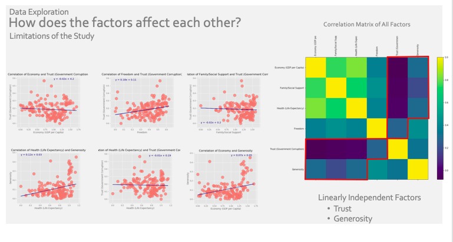

# Project-1-
World Happiness Report

Team Members:

Andrew Lau 
Ryla
Monali Patel

We will be diving into different measures that make up happiness according to the world happiness report , a landmark survey of the state of global happiness for 156 countries

We’ll look at data over 5 years, 2015 through 2019. and we’ll also find out how the 156 countries stack up against each other in the battle for the happiest country on earth

What is Happiness?

The quality of people’s lives can be coherently, reliably, and validly assessed by a variety of subjective well-being measures, collectively referred to then and in subsequent reports as “Happiness.”

Well-being Measures Factors :

1) Economy/GDP per capita is in terms of Purchasing Power Parity (PPP) taken from the World Development Indicators (WDI) released by the World Bank on November 14, 2018
2) Health life expectancy data is from the World Health Organization (WHO) Global Health Observatory 
3) Family/Social support – answers the question “If you were in trouble, do you have relatives or friends you can count on to help you whenever you need them, or not?”
4) Freedom – answers the question “Are you satisfied or dissatisfied with your freedom to choose what you do with your life?” 
5) Generosity – answers the question “Have you donated money to a charity in the past month?”
6) Trust or perceptions of corruption – answers the question “Is corruption widespread throughout the government or not?” and “Is corruption widespread within businesses or not?”

Dependencies

This project requires Python 3.5 and the following Python libraries installed:

Pandas

SciPy

Numpy

Matplotlib

Questions :

1) What are the factors affecting a country’s happiness?
2) Which years are the happiest for all countries? Which countries are the happiest in the happiest year? 
3) How does each factor affect each other?

Clean data using pandas library in Python within a [Jupyter notebook: Data_Cleaning.ipynb](Data_Cleaning.ipynb)

Factors affecting happiness : 

Create Scatter plots and perform statistical analysis using various Python libraries within a [Jupyter notebook: Scatter_Plots.ipynb](Scatter_Plots.ipynb). 

Here are 6 scatter plots with regression lines of the measures, or factors as we’ve been referring to them as,  that make up happiness score vs the actual happiness score. As expected, the factors all have a positive linear relationship with happiness. We've ranked them starting from the top left to the bottom right by slope. Economy has the highest slope which means it has the greatest linear relationship with happiness and Generosity has the lowest slope which means it has the smallest linear relationship with happiness.

Mean Happiness Score and Standard Deviation:

Create bar charts for standard Deviation within a [Jupyter notebook: bar_chart.ipynb](bar_chart.ipynb).
and create line graph for happiness score and perform statistical analysis using various Python libraries within a [Jupyter notebook: Line_Graph.ipynb](Line_Graph.ipynb).

The line plot on the left shows mean happiness for all countries from 2015 through 2019. 2019 has the highest average happiness in this time frame. We also have similar line graphs for each measure. ..… For the interest of time, we will not be reviewing each one in detail during our presentation, but they are here in the slide deck appendix for your reference.

Back to the main presentation… Over on the right, We have a bar chart that shows the standard deviation for each factor from 2015 through 2019 . It’s interesting to note that the standard deviation of the Happiness score is less than each of the happiness measures that make it up.

Even though there is much variation in the measures for family, economy, and health, the overall happiness score does not move much. When one factor falls it is compensated by a rise in another factor.

Happiest Countries:

Create Chloropeth map and perform statistical analysis using various Python libraries within a [Jupyter notebook: Chloropeth_map.ipynb](Chloropeth_map.ipynb). 

Now let’s see which are the happiest countries.

Shown is the choropleth map where the darker colored countries are those with high Happiness Index while the lighter colored ones are with low happiness score. You may refer to the happy meter on the right side for reference. As you can see in the map, majority of the happy countries are located in Europe. And topping 2019’s happy countries are Finland, Denmark and Norway. Majority of the countries Happiness score is between 4.3 to 6.3.

High Economy Countries

To further see the relationship of happiness index and other well being measures, we mapped out of the countries’ economic, family and health scores.

Shown here is the economic status of different countries. The darker the color, the higher the country’s GDP per capita. Topping the list are Qatar, Luxembourg and Singapore. Only two of the happy countries which are Norway and Switzerland made it to the list. Thus, like what they say, being rich does not necessarily make you happy.

High Family/Social Support Score Countries

In terms of family score, the darker colored countries feel that they have high social support while those light colored ones tend to be nations at war or faced with social inequality issues. The top five countries which have the highest family score also made it to the top 10 happiest countries.

Highest Health Score Countries

Lastly for health score, referencing to WHO’s data, the darker colored countries have higher healthy life expectancy compared to lighter colored ones. Topping the list are Asian countries: Singapore, Hong Kong and Japan.

How does the factors affect each other?

Create Corr matrix and perform statistical analysis using various Python libraries within a [Jupyter notebook: Corr_matrix.ipynb](Corr_matrix.ipynb). 

we discovered by looking at a correlation matrix of all the factors.Economy, family/social support and health are highly correlated with each other with coefficients of point 8 4, point 7 5, and point 7 2

Our conclusion here is that we don’t necessarily need all 3 of these factors in the study since they are so correlated with each other. Just one of them would be enough.

On this Image, let’s focus on the squares highlighted by the red borders. These have correlations between .3 and .7

Overall, Freedom is moderately correlated with many other factors. And Trust and Generosity are also moderately correlated with each other. Since it’s moderate, it’s not enough to draw a conclusion. We simply would like to point it out.

Lastly, we have the correlations less than point 3

The measures for trust and generosity are linearly independent from the other factors.  Our conclusion is that it is proper to include both these factors in the study since they explain happiness that can not be explained by any other measure.

Conclusion :

Happiness Score is a measure of general satisfaction with life and, more important, the confidence that one lives in a place where people take care of one another. There are six well being measures equated in computing for the Happiness Score: Economy, Family/Social Support, Health, Freedom, Trust and Generosity. 

Year 2019 has the highest average Happiness Score from all 156 countries.

European countries dominates the top ten Happiest Countries in the last five years. Year 2019 ended with Finland, Denmark and Norway as the top three.

Comparing all the measures, Economy, Family/Social Support and Health are strong contributors to the Happiness Score but among these three, it appears that having high Family/Social Support score tend to enhance the well being of individuals more compared to having high economic or health status.

